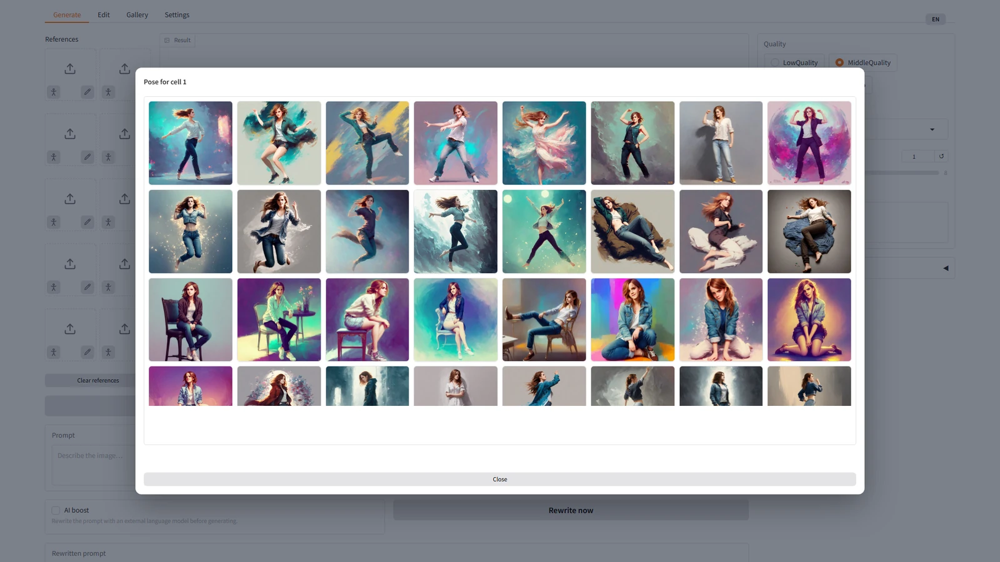

# Fooocus-Qwen-Image-2.1

**English** · [Русский](README.ru.md)

A [Fooocus](https://github.com/lllyasviel/Fooocus)-style studio for the local
[Qwen-Image-2.1](https://huggingface.co/Qwen/Qwen-Image-2.1) model: one prompt
line, one **Generate** button, and everything else behind **Advanced**. It
generates images from text, edits them by instruction — with a mask brush,
colour annotations or an exact region — extends the canvas, and takes up to ten
reference images. Everything runs on your own GPU.


<sub>All three images were made with the MiddleQuality preset (1536 px, 28 steps) straight from a plain prompt. The neon sign text is rendered by the model itself.</sub>

## Contents

- [Features](#features)
- [A tour of the interface](#a-tour-of-the-interface)
- [Requirements](#requirements)
- [Installation](#installation)
- [Running](#running)
- [Usage guide](#usage-guide)
- [Performance](#performance)
- [Privacy and security](#privacy-and-security)
- [Project layout](#project-layout)
- [Development](#development)
- [License](#license)
- [Acknowledgements](#acknowledgements)

## Features

- **Text to image** at three quality presets plus **Turbo** (a 6-step distilled
  model at 1 MP, about 2× faster than LowQuality), in seven aspect ratios, with 277 Fooocus styles and up
  to eight images per run.
- **Choose speed and memory**: bf16 or INT8 transformer weights (13.3 vs 6.8 GiB
  of VRAM, nearly the same speed) and optional SageAttention (15–25% faster
  steps). Pick them during installation or switch later in Settings; missing
  weights download with a progress bar.
- **Reference images**: up to ten, each addressed in the prompt as
  `<image1>`…`<image10>`. Any cell can take a **pose** — from a pose library
  or recognised from your own photo — or a hand-drawn **sketch**.
- **Instruction-based editing** in four region modes:
  - **Mask** — paint the area to change; every pixel outside it stays byte-for-byte intact.
  - **Annotation** — circle several areas in different colours and describe each change by its colour in one prompt.
  - **Exact region** — edit a crop around the mask at full detail, then paste it back.
  - **No region** — edit the whole frame.
- **Outpainting**: extend the canvas on any side; the new area becomes the mask.
- **A responsive mask brush** with size, eraser, undo/redo, zoom, pan,
  clipboard paste and touch support. Stroke cost stays constant — no lag on
  4K images (the stock Gradio editor's strokes slowed from 16.7 to 44 ms per
  move on a long stroke).
- **AI boost**: an external OpenAI-compatible language model (llama.cpp, vLLM,
  LM Studio) rewrites short prompts into detailed ones, using the official
  Qwen rewriting prompts. It also works with text-only models.
- **Gallery** with each image's parameters stored inside the PNG: reuse them,
  send the image back to the editor, or restore parameters from any PNG file.
- **Bilingual interface** (English / Russian), switchable at any time.
- **Built for a single 24 GB card**: model weights move between GPU and RAM
  automatically, prompt embeddings are cached and the VAE decodes in tiles
  without seams.

## A tour of the interface

### Generate

Type a prompt, pick a quality preset and press **Generate**. With **AI boost**
on, the prompt is first rewritten by your language model. **Rewrite now**
shows the rewritten text before you generate, so you can review or edit it.
Whatever is in the *Rewritten prompt* box is what the model receives.
**Send to editor** puts the selected result into the mask brush and opens the
Edit tab; **Send to references** puts it into the first free reference cell. Both buttons
also sit under the Edit tab's result.


Each reference cell has two small icons in its bottom corners. The figure
opens a pose library: pick a pose and its OpenPose skeleton goes into the
cell, and the model follows it.




The pencil opens a sketch canvas: draw, press **Accept**, and the sketch
becomes the reference.


### Edit with a mask

Paint over the area to change and describe the change. Only the painted area
is regenerated; the rest of the image is kept exactly. On wide screens the
brush and the result sit side by side.


Before and after — *“a small potted succulent in a terracotta pot”*:


### Edit several areas at once with annotations

Circle areas in different colours and refer to them by colour in one prompt.
This makes several independent edits in a single pass.


*“make the lanterns in the red outline glow soft blue, and place a small teacup in the blue outline”*


### Outpaint

Choose the sides to extend and describe the **whole scene** in the prompt;
the original pixels stay untouched.


### Gallery

Each result is saved with its parameters inside the PNG. Select an image to
see them, then reuse them on the Generate tab or open the image in the editor.


### Settings

This tab holds the language model address, the system prompts used by AI boost,
the **performance** choices (transformer precision and SageAttention) and a GPU
memory report. The access token is write-only: the page never shows it.


## Requirements

| | Minimum | Tested on |
|---|---|---|
| GPU | NVIDIA, 24 GB VRAM | RTX 3090, 24 GB |
| RAM | 64 GB | 128 GB |
| Disk | ~35 GB for the model weights | |
| OS | Windows 11; Linux via `install.sh` / `run.sh` (not tested on this build) | Windows 11 |
| Python | 3.12 (3.13 works) | 3.12 |

The large RAM requirement is deliberate. A pinned copy of the text encoder
lives in RAM, so the diffusion transformer can stay resident on the GPU. The
weights then don't cross the PCIe bus on every generation (see
[docs/ARCHITECTURE.md](docs/ARCHITECTURE.md), section 3). If RAM is short, run
with `--no-pin-memory`.

## Installation

Windows, from the project root:

```powershell
.\install.ps1
.\run.ps1
```

Linux:

```bash
./install.sh
./run.sh
```

The installer:

1. creates `.venv` with Python 3.12;
2. installs `torch`/`torchvision` from the PyTorch CUDA index, then the rest of `requirements.txt`;
3. checks that `torch` really is a CUDA build — some packages quietly swap it for a CPU one;
4. **asks about performance**: transformer precision — bf16 (original, 13.3 GiB
   of VRAM) or INT8 (6.8 GiB, nearly the same speed) — and whether to install
   SageAttention (15–25% faster; on Windows a prebuilt wheel plus
   `triton-windows` matching your torch). Press Enter to keep bf16 without
   SageAttention;
5. **downloads the model weights** (`Qwen/Qwen-Image-2.1`) into `Qwen-Image-2.1/`:
   ~33 GB for bf16; for INT8 the bf16 transformer shards are skipped and the
   INT8 transformer (7.3 GB, `unsloth/Qwen-Image-2.1-FP8`) goes to
   `Qwen-Image-2.1-INT8/`, ~26 GB in total. It checks the files listed in the
   model's index, resumes an interrupted download and skips what is already
   there;
6. **asks for the language model address and token** for AI boost and tests
   the connection. Press Enter to skip: everything except AI boost and
   *Describe image* works without it;
7. runs a self-test of the environment.

Useful commands:

```powershell
.\install.ps1 -Recreate                                  # rebuild .venv from scratch
.venv\Scripts\python -m fooocus_qwen --selftest          # check the environment
.venv\Scripts\python -m fooocus_qwen --fetch-model       # download / complete the weights
.venv\Scripts\python -m fooocus_qwen --setup-llm         # set the language model again
.venv\Scripts\python -m fooocus_qwen --setup-performance # choose precision and SageAttention again
```

## Running

`run.ps1` starts the server on `0.0.0.0:7865`, so other machines on your
network can reach it too. It opens `http://127.0.0.1:7865` in your browser as
soon as the page can be served. The model loads in the background while you
type the first prompt (about 30 seconds).

Arguments are passed through to the application:

```powershell
.\run.ps1 --lang en --port 7870 --preset LowQuality
```

| Flag | Meaning |
|---|---|
| `--host`, `--port` | listen address (default `0.0.0.0:7865`) |
| `--lang ru\|en` | interface language at start |
| `--preset LowQuality\|MiddleQuality\|MaxQuality` | default quality preset |
| `--no-open-browser` | don't open the browser |
| `--no-preload` | load the model on first use instead of at start |
| `--no-pin-memory` | don't pin the text encoder in RAM (saves 16+ GB, slower model swaps) |
| `--verbose` | detailed log |
| `--prompt "…" --out file.png` | one generation without the interface |
| `--selftest` | check the environment and exit |

## Usage guide

The full guide is in Russian: [docs/USAGE.md](docs/USAGE.md). The essentials follow.

### Quality presets

| Preset | Resolution | Steps | Time on RTX 3090 |
|---|---|---|---|
| LowQuality | 1024 px | 16 | ~21 s |
| MiddleQuality | 1536 px | 28 | ~93 s |
| MaxQuality | 2048 px | 40 | ~283 s |
| **Turbo** | 1024 px | 6 | ~11 s |

**Turbo** uses [Qwen-Image-2.1-viggle-turbo](https://huggingface.co/Viggle/Qwen-Image-2.1-viggle-turbo),
a distilled LoRA for this model: 6 steps without CFG instead of 16–40, for
generation and editing. It stays at 1 megapixel, the area it was distilled at:
above it the distilled model draws a fine 8-pixel grid, the same with bf16,
INT8 and SageAttention and in the authors' own reference code, so Turbo is a
fast 1 MP preset rather than a faster MiddleQuality. The adapter (1.3 GB) downloads the first
time you pick the preset. Negative prompt and guidance are ignored in Turbo.
Its authors have not validated mask editing and transparent (RGBA) output.

### Speed and memory: precision and SageAttention

On the Settings tab, under *Transformer precision*:

- **bf16** — the original weights, 13.3 GiB of VRAM;
- **INT8** — [Unsloth's INT8 weights](https://huggingface.co/unsloth/Qwen-Image-2.1-FP8)
  loaded weight-only: 6.8 GiB resident instead of 13.3, about 5% slower.
  Unsloth measured LPIPS 0.064 against bf16. It frees memory for the denoising
  phase — where references run out of it — and for other programs; while a
  new prompt is encoded the text encoder (16.3 GiB) is on the card in both
  modes, so that brief peak does not change.

*Apply precision* downloads the missing weights (with a progress bar) and
reloads the model. **SageAttention** switches on the fly; the checkbox is
active only when the package is installed (choose it in `install.ps1`). On an
RTX 3090 it makes a step 15–25% faster at 1536 px and above.

### Reference images

References live in a grid of ten cells to the left of the result on the
Generate tab — two columns of five, as tall as the result, empty by default. Click a cell to pick a
file or drop an image onto it; the cross in a cell's corner clears it, and
**Clear references** under the grid empties them all.

Each filled cell is labelled with its tag. With two or more references, the
prompt must refer to them as `<image1>`, `<image2>`, … — the model does not
understand “the first photo”. Tags follow the order of the **filled** cells,
not the cell number: empty cells are not sent to the model, so cells 1, 3
and 7 are `<image1>`, `<image2>` and `<image3>`. With exactly one reference,
don't use a tag at all.

**Poses.** The figure icon on a cell opens the pose library: the 46 poses of
[openposes.com](https://openposes.com/) (model: Emma Watson), then your own.
Clicking a tile puts its skeleton into the cell. The catalogue ships with the
project in `resources/poses/catalog/`; `tools\fetch_poses.py` refreshes it
from the site.

The last tile, **Add a pose**, takes a photo of a person. The pose is
recognised on the CPU in a fraction of a second with
[DWPose](https://github.com/IDEA-Research/DWPose) (its 350 MB of ONNX weights
are downloaded by the installer), the skeleton goes into the cell at once, and
the pose is saved to `user/outputs/poses/`, next to your generations. Qwen-Image then draws a tile for it in the
catalogue's style (about 13 s with Turbo if its adapter is already downloaded,
LowQuality otherwise).

**Sketches.** The pencil icon opens a white canvas with the same brush as the Edit tab:
palette, size, eraser, undo/redo, zoom. **Accept** puts the drawing into the
cell, **Cancel** closes the window.

More references use more memory. **Reference detail** (under Advanced) sets
the resolution the references are scaled to; *Auto* picks it from the number
of condition images and says so in the status line. At full detail, five
references at 1536 px overflow a 24 GB card and a frame takes minutes instead
of seconds.

### Editing

The Edit tab changes an image by instruction. The prompt is required: it says
what to change. The region mode decides where the change goes:

| Mode | What you paint | What happens |
|---|---|---|
| **Mask** (default) | the area to change | only the masked area changes; pixels outside are kept exactly |
| **Annotation** | several areas in different colours | the colours become part of the image; refer to them in the prompt (“the red circle…”) |
| **Exact region** | a small area on a large image | a crop around the mask is edited at full detail and pasted back |
| **No region** | nothing | the whole frame is edited |

The Edit tab has its own reference grid to the left of the brush, with the
same pose and sketch tools: “put the cat from `<image3>` into the marked
area”. There `<image1>` is the image being edited; in Mask and Exact region
modes `<image2>` is the mask, so references start at `<image3>` (at
`<image2>` in the other modes). The cell labels follow the region mode, and
if the mask turns out empty the status line says where the tags moved.

*Mask grow* and *Feather* (under Advanced) widen the mask and soften the
paste seam. The model itself always receives a hard black-and-white mask: it
reads a grey edge as “make this transparent”.

### The mask brush

| Action | Mouse | Keyboard |
|---|---|---|
| brush / eraser | toolbar; the right mouse button always erases | B / E; X toggles |
| brush size | slider, Shift + wheel | `[` and `]` |
| undo / redo | toolbar | Ctrl+Z / Ctrl+Y |
| zoom to cursor | wheel | — |
| pan | middle button, or Space + drag | — |
| fit to view | toolbar | F or 0 |
| show / hide marks | eye button | H |
| invert / clear marks | toolbar | — |

Load an image by dropping it on the brush, with the **+** button, with
**Ctrl+V** while the pointer is over the canvas, or with **Open in editor** in
the gallery. On a touch screen, draw with one finger; pinch and drag with two.

### Outpainting

Open **Outpaint**, tick the sides and the amount, press **Outpaint**. The new
area becomes the mask and the edit is an ordinary mask edit.

**Describe the whole picture, not the operation.** Prompts like “continue the
scene” or “extend the background” make the model fill the new area with
transparency. A description of the finished picture works every time.

### AI boost

Set the address of an OpenAI-compatible server during installation or on the
Settings tab. With **AI boost** on, the prompt is rewritten before
generation. If the language model can't read images, the edit rewrite falls
back to the text alone and says so. Rewritten descriptions are in English
unless the instruction is in Chinese. Text you want drawn in the image — in
double quotes — keeps its own language.

## Performance

Measured on an RTX 3090 (24 GB); median of steady-state runs:

| | Time | Peak VRAM |
|---|---|---|
| LowQuality, 1024 px | 21.5 s | 17.0 GiB |
| MiddleQuality, 1536 px | 93.0 s | 15.2 GiB |
| MaxQuality, 2048 px | 283.5 s | 16.2 GiB |
| MiddleQuality + 1 reference | 123.9 s | 21.0 GiB |
| Turbo, 1280×832 | 10.4 s | 16.8 GiB |
| Turbo + SageAttention on INT8, 1280×832 | 10.0 s | **10.4 GiB** |
| Model load | 33.8 s | |

Turbo figures are for a cached prompt; a new prompt adds ~1.5 s and a 17 GiB
peak while the text encoder runs. The details are in [docs/research/2026-09-24-uskorenie-turbo-sage-int8.md](docs/research/2026-09-24-uskorenie-turbo-sage-int8.md)
(in Russian).

The compute is close to the card's limit: 53.8 of 71.5 TFLOPS. Full numbers
and methodology: [docs/BENCHMARK.md](docs/BENCHMARK.md).

## Privacy and security

- **No telemetry.** Generation is local, and Gradio analytics and its version
  check are switched off. The only outgoing requests go to your own language
  model server, and only when you use AI boost or *Describe image*.
- **The language model token never reaches the browser.** The interface
  listens on your local network, so the Settings tab treats the token as
  write-only. The token is also kept out of logs.
- **Your data stays out of the repository.** `llm_endpoint.txt` (address and
  token), `user/` (images and saved prompts), `logs/` and `tmp/` are all
  git-ignored.
- **Paths from the browser are not trusted**: the mask brush only accepts
  image paths inside Gradio's upload folder.

## Project layout

```
fooocus_qwen/
  engine/      pipeline loading, generation, GPU residency, embedding cache, tiled VAE
  imaging/     masks, outpaint planning, aspect ratios, PNG metadata
  prompting/   AI boost, styles, saved prompts
  llm/         OpenAI-compatible client, endpoint file, installer dialogue
  storage/     output folders by date
  poses/       OpenPose skeletons, pose recognition (DWPose), the pose library, pose tiles
  ui/          Gradio tabs, the mask brush (ui/painter/), reference tools, layout, translations
resources/     Fooocus styles, the Qwen system prompts, the "Add a pose" tile
tools/         smoke test, benchmark, UI check, screenshot builder, experiments
docs/          architecture, usage guide, benchmark, research notes (in Russian)
tests/         unit tests (no GPU needed)
```

## Development

```powershell
.venv\Scripts\python -m pip install -r requirements-dev.txt
.venv\Scripts\python -m playwright install chromium

.venv\Scripts\python -m pytest -q                 # 800+ unit tests, no GPU needed
.venv\Scripts\python -m ruff check .              # lint, rules in ruff.toml
.venv\Scripts\python tools\ui_check.py            # the interface in a real browser, fake generator
.venv\Scripts\python tools\smoke.py               # end-to-end run with the real model
.venv\Scripts\python tools\docs_screenshots.py --phase showcase   # README images with the real model,
.venv\Scripts\python tools\docs_screenshots.py --phase ui         # then the interface screenshots
```

- `tools/ui_check.py` starts the interface exactly as `run.ps1` does, with a
  fake generator in place of the model. In Chromium it checks the layout at
  six window sizes, language switching, where the mask lands in the frame,
  brush latency, the gallery and that the token never appears on the page.
- `tools/docs_screenshots.py` rebuilds every image in this README from a live
  run. Its temporary files go to `tmp/`.
- The documentation in `docs/` is in Russian. [docs/ARCHITECTURE.md](docs/ARCHITECTURE.md)
  explains the design decisions; `docs/research/` has the measurements behind
  them.

## License

The code is released under the [MIT License](LICENSE).

The Qwen-Image-2.1 **model weights are licensed separately** under the
[Qwen Research License Agreement](https://huggingface.co/Qwen/Qwen-Image-2.1),
which allows non-commercial use only — defined there as *research or
evaluation*. Commercial use requires a separate license from the model's
authors. The MIT license on this code does not lift those terms, and the
application does nothing without the weights. Read the model license before
using the application or the images it produces.

## Acknowledgements

- [Qwen-Image](https://github.com/QwenLM/Qwen-Image) by the Qwen team — the model and the official prompt-rewriting prompts.
- [Fooocus](https://github.com/lllyasviel/Fooocus) by lllyasviel — the interface philosophy and the style catalogue.
- [diffusers](https://github.com/huggingface/diffusers) and [Gradio](https://github.com/gradio-app/gradio).
