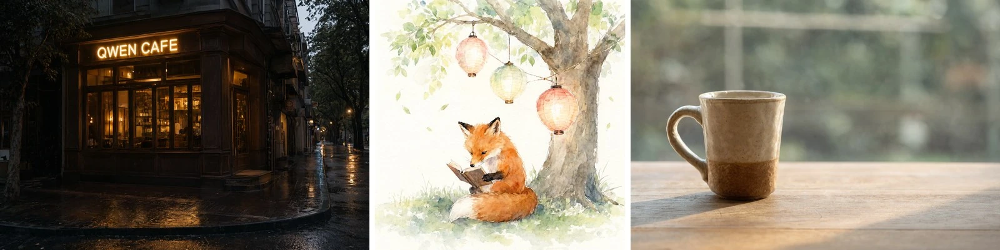
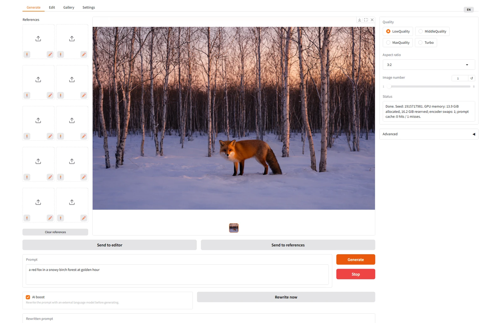
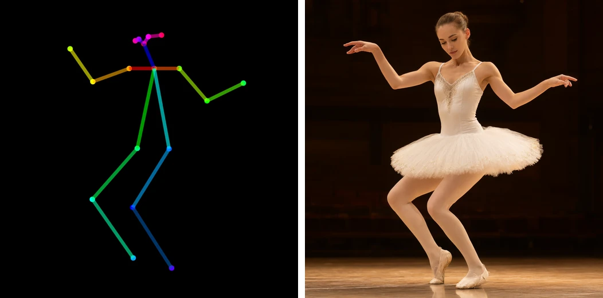
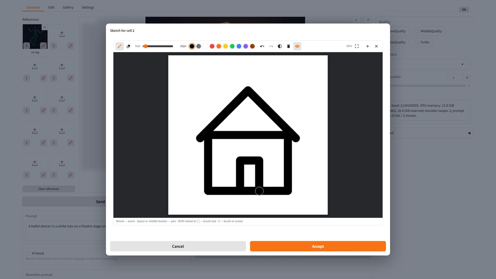
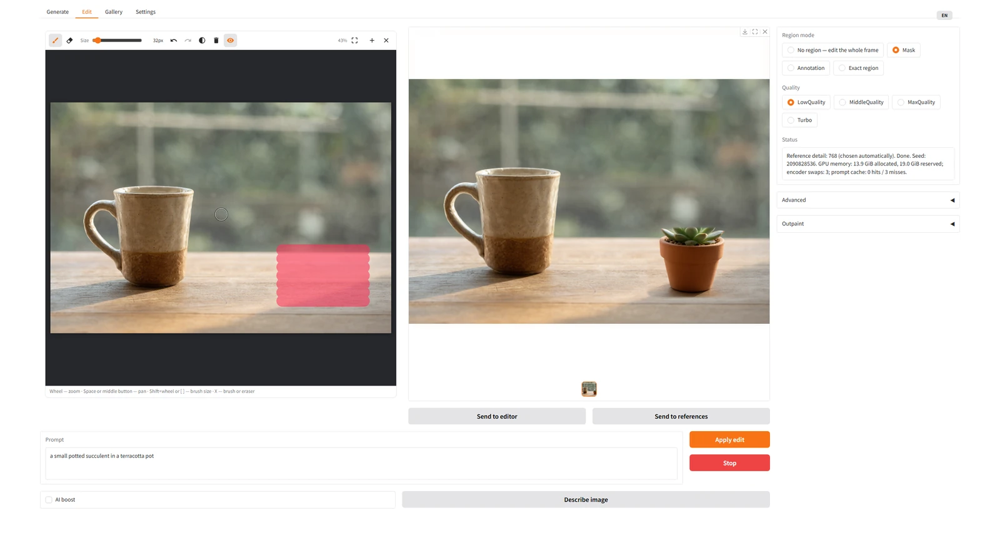
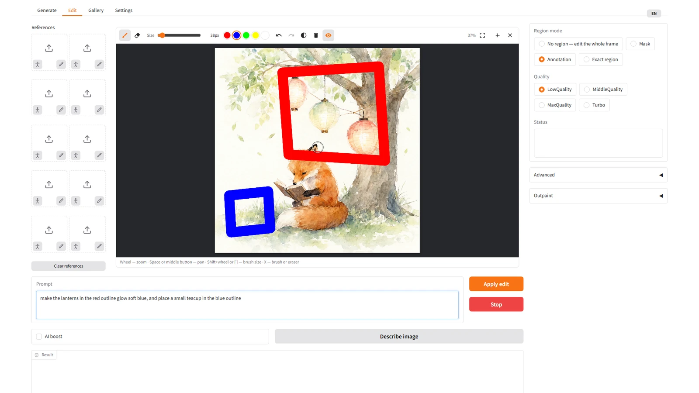
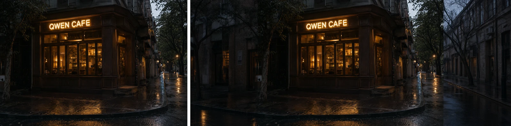
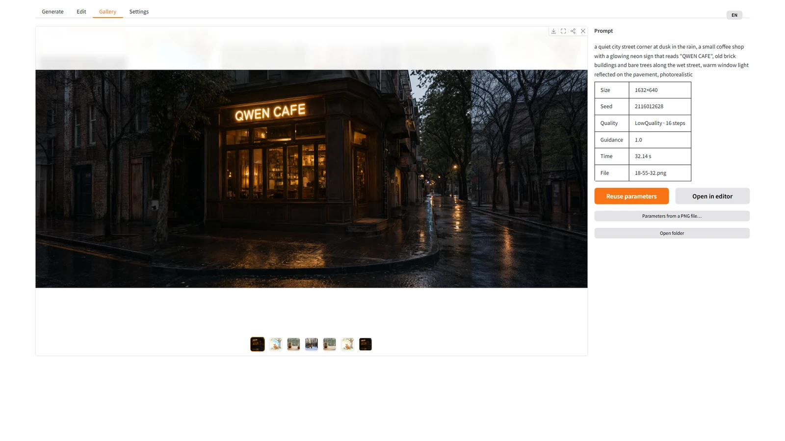
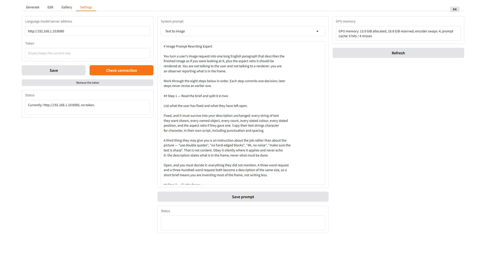

# Fooocus-Qwen-Image-2.1

[English](README.md) · **Русский**

Студия в духе [Fooocus](https://github.com/lllyasviel/Fooocus) для локальной
модели [Qwen-Image-2.1](https://huggingface.co/Qwen/Qwen-Image-2.1): одна строка
промта, одна кнопка «Сгенерировать», всё остальное — под «Продвинутым».
Генерация из текста, правка по инструкции — кистью маски, цветными
аннотациями или по точной области, — расширение холста и до десяти
референсов. Всё работает на вашей видеокарте.



<sub>Все три картинки — пресет MiddleQuality (1536 px, 28 шагов), обычный промт без доработки; надпись на вывеске нарисована самой моделью.</sub>

## Содержание

- [Возможности](#возможности)
- [Интерфейс](#интерфейс)
- [Требования](#требования)
- [Установка](#установка)
- [Запуск](#запуск)
- [Как пользоваться](#как-пользоваться)
- [Производительность](#производительность)
- [Приватность и безопасность](#приватность-и-безопасность)
- [Устройство проекта](#устройство-проекта)
- [Разработка](#разработка)
- [Лицензия](#лицензия)
- [Благодарности](#благодарности)

## Возможности

- **Генерация из текста**: три пресета качества и **Turbo** (дистиллят на 6
  шагов при 1 Мп, примерно вдвое быстрее LowQuality), семь соотношений сторон, 277 стилей Fooocus, до
  восьми изображений за запуск.
- **Выбор скорости и памяти**: веса трансформера в bf16 или INT8 (13.3 против
  6.8 ГиБ видеопамяти при почти той же скорости) и необязательный
  SageAttention (шаг на 15–25 % быстрее). Выбирается при установке и
  переключается в настройках; недостающие веса докачиваются с прогрессом.
- **Референсы** — до десяти изображений, в промте каждое адресуется тегом
  `<image1>`…`<image10>`. В любую ячейку можно положить **позу** — из
  библиотеки или распознанную на своём фото — или нарисованный от руки **эскиз**.
- **Правка по инструкции** в четырёх режимах области:
  - **Маска** — закрасьте то, что нужно изменить; всё вне маски остаётся побайтово нетронутым.
  - **Аннотация** — обведите несколько областей разными цветами и опишите каждую правку по её цвету в одном промте.
  - **Точная область** — правка кропа вокруг маски в полной детальности с вклейкой обратно.
  - **Без области** — правка всего кадра.
- **Расширение холста (outpaint)** с любой стороны; новая площадь становится маской.
- **Отзывчивая кисть маски**: размер, ластик, отмена и повтор, масштаб, сдвиг,
  вставка из буфера обмена, сенсорный ввод. Стоимость мазка постоянна —
  никакого запаздывания на кадрах 4K (у стандартного редактора Gradio она
  росла по ходу мазка с 16.7 до 44 мс на движение).
- **AI буст**: внешняя OpenAI-совместимая языковая модель (llama.cpp, vLLM,
  LM Studio) переписывает короткий промт в подробный по официальным
  системным промтам Qwen. Работает и с моделями без зрения.
- **Галерея** с параметрами каждого изображения прямо в PNG: повторить их,
  вернуть картинку в редактор, восстановить параметры из любого PNG.
- **Двуязычный интерфейс** (русский / английский), переключается на ходу.
- **Рассчитано на одну карту 24 ГБ**: веса сами переезжают между видеопамятью
  и ОЗУ, эмбеддинги промтов кэшируются, VAE декодирует плитками без швов.

## Интерфейс

### Генерация

Введите промт, выберите пресет качества и нажмите «Сгенерировать». С
включённым **AI бустом** промт сначала переписывает языковая модель. Кнопка
«Переписать сейчас» показывает переписанный текст до генерации — его можно
проверить и поправить. В модель уходит то, что стоит в поле «Переписанный
промт». «Отправить в редактор» кладёт выбранный результат в кисть и
открывает вкладку «Редактирование», «Отправить в референсы» кладёт его в
первую свободную ячейку референсов. Обе кнопки есть и под результатом правки.



На каждой ячейке референса два значка. 🧍 открывает библиотеку поз: выбранная
поза ложится в ячейку скелетом OpenPose, и модель ему следует.



✏️ открывает холст для эскиза: нарисуйте, нажмите «Принять» — и набросок
становится референсом.



### Правка по маске

Закрасьте область и опишите, что с ней сделать. Перерисовывается только
закрашенное, остальное сохраняется в точности. На широком экране кисть и
результат стоят рядом.



До и после — *«a small potted succulent in a terracotta pot»*:


### Несколько правок разом: аннотации

Обведите области разными цветами и сошлитесь на них по цвету в одном промте —
несколько независимых правок за один проход.



*«make the lanterns in the red outline glow soft blue, and place a small teacup in the blue outline»*


### Расширение холста

Отметьте стороны и опишите в промте **всю сцену**; исходные пиксели не меняются.



### Галерея

Каждый результат хранит параметры внутри PNG. Выберите картинку, чтобы их
увидеть, и повторите на вкладке генерации или откройте картинку в редакторе.



### Настройки

Адрес языковой модели, системные промты AI буста, **производительность**
(точность трансформера и SageAttention) и отчёт о видеопамяти. Токен доступа
только записывается — страница его никогда не показывает.



## Требования

| | Минимум | Проверено на |
|---|---|---|
| Видеокарта | NVIDIA, 24 ГБ | RTX 3090, 24 ГБ |
| ОЗУ | 64 ГБ | 128 ГБ |
| Диск | ~35 ГБ под веса модели | |
| ОС | Windows 11; Linux — через `install.sh` / `run.sh` (на этой сборке не проверялся) | Windows 11 |
| Python | 3.12 (подойдёт 3.13) | 3.12 |

Требование к ОЗУ сознательное: закреплённая копия текстового энкодера в
оперативной памяти позволяет держать трансформер на видеокарте постоянно и не
гонять веса по шине на каждую генерацию (см.
[docs/ARCHITECTURE.md](docs/ARCHITECTURE.md), раздел 3). При нехватке ОЗУ —
ключ `--no-pin-memory`.

## Установка

Windows, из корня проекта:

```powershell
.\install.ps1
.\run.ps1
```

Linux:

```bash
./install.sh
./run.sh
```

Что делает установка:

1. создаёт `.venv` на Python 3.12;
2. ставит `torch`/`torchvision` с CUDA-индекса PyTorch, затем остальное из `requirements.txt`;
3. проверяет, что `torch` действительно собран с CUDA — сторонние пакеты умеют незаметно подменить его CPU-сборкой;
4. **спрашивает о производительности**: точность трансформера — bf16
   (исходная, 13.3 ГиБ видеопамяти) или INT8 (6.8 ГиБ, скорость почти та же)
   — и ставить ли SageAttention (на 15–25 % быстрее; под Windows — готовая
   сборка и `triton-windows` под ваш torch). Enter — bf16 без SageAttention;
5. **скачивает веса модели** (`Qwen/Qwen-Image-2.1`) в `Qwen-Image-2.1/`:
   ~33 ГБ при bf16; при INT8 bf16-шарды трансформера не качаются, а
   INT8-трансформер (7.3 ГБ, `unsloth/Qwen-Image-2.1-FP8`) ложится в
   `Qwen-Image-2.1-INT8/` — всего ~26 ГБ. Сверяет файлы с индексом модели,
   докачивает оборванное, не трогает то, что уже на месте;
6. **спрашивает адрес и токен языковой модели** для AI буста и проверяет связь.
   Enter пропускает шаг: без неё работает всё, кроме AI буста и «Описать изображение»;
7. проверяет окружение.

Полезные команды:

```powershell
.\install.ps1 -Recreate                                  # пересоздать .venv с нуля
.venv\Scripts\python -m fooocus_qwen --selftest          # проверить окружение
.venv\Scripts\python -m fooocus_qwen --fetch-model       # скачать или докачать веса
.venv\Scripts\python -m fooocus_qwen --setup-llm         # заново настроить языковую модель
.venv\Scripts\python -m fooocus_qwen --setup-performance # заново выбрать точность и SageAttention
```

## Запуск

`run.ps1` поднимает сервер на `0.0.0.0:7865` — он доступен и с других машин
вашей сети — и открывает `http://127.0.0.1:7865` в браузере, как только
страницу можно отдать. Модель грузится в фоне, пока вы набираете первый промт
(около 30 секунд).

Аргументы передаются приложению:

```powershell
.\run.ps1 --lang en --port 7870 --preset LowQuality
```

| Ключ | Значение |
|---|---|
| `--host`, `--port` | адрес прослушивания (по умолчанию `0.0.0.0:7865`) |
| `--lang ru\|en` | язык интерфейса при запуске |
| `--preset LowQuality\|MiddleQuality\|MaxQuality` | пресет качества по умолчанию |
| `--no-open-browser` | не открывать браузер |
| `--no-preload` | грузить модель при первом обращении, а не при запуске |
| `--no-pin-memory` | не закреплять текстовый энкодер в ОЗУ (экономит 16+ ГБ ценой более медленной перестановки моделей) |
| `--verbose` | подробный журнал |
| `--prompt "…" --out файл.png` | одна генерация без интерфейса |
| `--selftest` | проверить окружение и выйти |

## Как пользоваться

Подробное руководство — [docs/USAGE.md](docs/USAGE.md). Коротко о главном.

### Пресеты качества

| Пресет | Разрешение | Шагов | Время на RTX 3090 |
|---|---|---|---|
| LowQuality | 1024 px | 16 | ~21 с |
| MiddleQuality | 1536 px | 28 | ~93 с |
| MaxQuality | 2048 px | 40 | ~283 с |
| **Turbo** | 1024 px | 6 | ~11 с |

**Turbo** работает на [Qwen-Image-2.1-viggle-turbo](https://huggingface.co/Viggle/Qwen-Image-2.1-viggle-turbo)
— дистиллированном адаптере LoRA к этой же модели: 6 шагов без CFG вместо
16–40, генерация и правка. Разрешение — 1 мегапиксель, на котором дистиллят
учили: выше он рисует мелкую сетку с шагом 8 пикселей — одинаково на bf16,
INT8 и с SageAttention и в эталонном коде авторов. Так что Turbo — быстрый
пресет на 1 Мп, а не ускоренный MiddleQuality. Адаптер (1.3 ГБ) скачивается при первом
выборе пресета. Негативный промт и guidance в Turbo не действуют. Правку по
маске и прозрачный фон (RGBA) авторы дистиллята не проверяли.

### Скорость и память: точность и SageAttention

Во вкладке «Настройки», «Точность трансформера»:

- **bf16** — исходные веса, 13.3 ГиБ видеопамяти;
- **INT8** — [INT8-веса Unsloth](https://huggingface.co/unsloth/Qwen-Image-2.1-FP8)
  в режиме «только веса»: 6.8 ГиБ на карте вместо 13.3, примерно на 5 %
  медленнее; LPIPS к bf16 по замеру Unsloth — 0.064. Освобождает память на
  время генерации — там её и не хватает референсам — и для других программ.
  Пока кодируется новый промт, на карте в обоих режимах текстовый энкодер
  (16.3 ГиБ), и этот короткий пик не меняется.

«Применить точность» докачивает недостающие веса (с прогрессом) и
перезагружает модель. **SageAttention** переключается на лету; галочка
активна, только если пакет установлен (выберите его в `install.ps1`). На RTX
3090 шаг при 1536 px и выше становится быстрее на 15–25 %.

### Референсы

Референсы — сетка из десяти ячеек слева от результата на вкладке генерации,
два столбца по пять в рост поля результата, по умолчанию пустая. Картинку кладут в ячейку кликом или
перетаскиванием, убирают крестиком в углу; «Очистить референсы» под сеткой
опустошает её целиком.

Заполненная ячейка подписана своим тегом. При двух и более референсах промт
обязан ссылаться на них тегами `<image1>`, `<image2>`, …: «первое фото»
модель не понимает. Тег идёт по порядку **заполненных** ячеек, а не по
номеру ячейки: пустые в модель не уходят, так что ячейки 1, 3 и 7 — это
`<image1>`, `<image2>` и `<image3>`. При ровно одном референсе теги не нужны.

**Позы.** 🧍 на ячейке открывает библиотеку поз: позы
[openposes.com](https://openposes.com/) (модель — Эмма Уотсон), за ними —
ваши. Клик по плитке кладёт в ячейку её скелет. Каталог (около 11 МБ)
скачивается при первом открытии окна; заранее это делает
`tools\fetch_poses.py`, в том числе из уже скачанного `poses.zip`
(`--archive`). В репозиторий плитки не входят — лицензии на них сайт не
объявляет.

Последняя плитка, «Добавить позу», принимает фото человека. Поза
распознаётся на процессоре за доли секунды
([DWPose](https://github.com/IDEA-Research/DWPose); 350 МБ его весов ONNX
качаются при первом распознавании), скелет сразу ложится в ячейку, а поза
сохраняется в `user/poses/`. Следом Qwen-Image рисует для неё плитку в стиле
каталога (около 13 с на Turbo, если его адаптер уже скачан, иначе — на
LowQuality).

**Эскизы.** ✏️ открывает белый холст с кистью вкладки правки: палитра,
размер, ластик, отмена и повтор, масштаб. «Принять» кладёт рисунок в ячейку,
«Отмена» закрывает окно.

Референсы съедают память. «Детальность референсов» в «Продвинутом» задаёт,
к какому разрешению они приводятся; «Авто» выбирает по числу условных
изображений и сообщает об этом в строке состояния. При полной детальности
пять референсов на 1536 px переполняют карту 24 ГБ, и кадр идёт минуты
вместо секунд.

### Правка

Вкладка «Редактирование» меняет изображение по инструкции. Промт обязателен —
это и есть инструкция. Режим области решает, где будет правка:

| Режим | Что рисуете | Что происходит |
|---|---|---|
| **Маска** (по умолчанию) | область правки | меняется только маска; пиксели вне её сохраняются в точности |
| **Аннотация** | несколько областей разными цветами | цвета становятся частью картинки; ссылайтесь на них в промте («красный круг…») |
| **Точная область** | маленькую область на большом кадре | кроп вокруг маски правится в полной детальности и вклеивается обратно |
| **Без области** | ничего | правится весь кадр |

«Запас маски» и «Растушёвка» в «Продвинутом» расширяют маску и смягчают шов
склейки. Модели маска всегда уходит резкой, чисто чёрно-белой: серый край
она читает как «сделай прозрачным».

### Кисть маски

| Действие | Мышь | Клавиша |
|---|---|---|
| кисть / ластик | панель; правая кнопка мыши стирает всегда | B / E; X — переключить |
| размер кисти | ползунок, Shift+колесо | `[` и `]` |
| отменить / повторить | панель | Ctrl+Z / Ctrl+Y |
| масштаб к курсору | колесо | — |
| сдвиг | средняя кнопка или пробел + перетаскивание | — |
| вписать в окно | панель | F или 0 |
| показать / скрыть разметку | кнопка «глаз» | H |
| инвертировать / стереть разметку | панель | — |

Картинку в кисть можно перетащить, открыть кнопкой «+», вставить **Ctrl+V**,
когда указатель над холстом, или отправить из галереи кнопкой «Открыть в
редакторе». На сенсорном экране одним пальцем рисуют, двумя — масштабируют и
сдвигают.

### Расширение холста

Откройте «Расширить холст», отметьте стороны и долю, нажмите «Расширить
холст». Новая площадь становится маской, дальше это обычная правка по маске.

**Описывайте всю картину, а не операцию.** «Продолжи сцену», «расширь фон» —
и модель заливает новую площадь прозрачностью. Описание готовой картины
работает всегда.

### AI буст

Адрес OpenAI-совместимого сервера задаётся при установке или на вкладке
«Настройки». С включённым **AI бустом** промт переписывается перед
генерацией. Если языковая модель не читает изображения, буст правки
переписывает промт по одному тексту и сообщает об этом. Описание получается
по-английски, если инструкция не на китайском. Текст, который должен
появиться на картинке, — в двойных кавычках — сохраняет свой язык.

## Производительность

RTX 3090 (24 ГБ), медиана установившихся прогонов:

| | Время | Пик видеопамяти |
|---|---|---|
| LowQuality, 1024 px | 21.5 с | 17.0 ГиБ |
| MiddleQuality, 1536 px | 93.0 с | 15.2 ГиБ |
| MaxQuality, 2048 px | 283.5 с | 16.2 ГиБ |
| MiddleQuality + 1 референс | 123.9 с | 21.0 ГиБ |
| Turbo, 1280×832 | 10.4 с | 16.8 ГиБ |
| Turbo + SageAttention на INT8, 1280×832 | 10.0 с | **10.4 ГиБ** |
| Загрузка модели | 33.8 с | |

Время Turbo — для промта из кэша; новый промт добавляет ~1.5 с и пик 17 ГиБ,
пока работает текстовый энкодер. Подробности — [docs/research/2026-09-24-uskorenie-turbo-sage-int8.md](docs/research/2026-09-24-uskorenie-turbo-sage-int8.md).

Вычисления идут у потолка карты — 53.8 из 71.5 TFLOPS. Полные числа и
методика: [docs/BENCHMARK.md](docs/BENCHMARK.md).

## Приватность и безопасность

- **Никакой телеметрии.** Генерация локальная, аналитика Gradio и проверка
  версии выключены. Единственные исходящие запросы — к вашему серверу
  языковой модели, и только при AI бусте или «Описать изображение».
- **Токен языковой модели не попадает в браузер.** Интерфейс доступен в
  локальной сети, поэтому на вкладке «Настройки» токен можно только
  записать. В журналы он тоже не попадает.
- **Ваши данные не попадают в репозиторий**: `llm_endpoint.txt` (адрес и
  токен), `user/` (картинки и сохранённые промты), `logs/` и `tmp/` — в
  `.gitignore`.
- **Путям из браузера кисть не доверяет**: принимаются только файлы из
  каталога загрузок Gradio.

## Устройство проекта

```
fooocus_qwen/
  engine/      загрузка пайплайна, генерация, размещение весов, кэш эмбеддингов, тайловый VAE
  imaging/     маски, план расширения холста, соотношения сторон, метаданные PNG
  prompting/   AI буст, стили, сохранённые промты
  llm/         OpenAI-совместимый клиент, файл адреса, диалог установки
  storage/     каталоги результатов по датам
  poses/       скелеты OpenPose, распознавание позы (DWPose), библиотека поз, плитки поз
  ui/          вкладки Gradio, кисть маски (ui/painter/), инструменты ячеек референсов, раскладка, переводы
resources/     стили Fooocus, системные промты Qwen, плитка «Добавить позу»
tools/         дымовой прогон, замеры, проверка интерфейса, снимки для README, опыты
docs/          архитектура, руководство, замеры, исследования
tests/         модульные тесты (видеокарта не нужна)
```

## Разработка

```powershell
.venv\Scripts\python -m pip install -r requirements-dev.txt
.venv\Scripts\python -m playwright install chromium

.venv\Scripts\python -m pytest -q                 # 800+ модульных тестов, без видеокарты
.venv\Scripts\python -m ruff check .              # статическая проверка, правила в ruff.toml
.venv\Scripts\python tools\ui_check.py            # интерфейс в настоящем браузере, подставной генератор
.venv\Scripts\python tools\smoke.py               # сквозной прогон с настоящей моделью
.venv\Scripts\python tools\docs_screenshots.py --phase showcase   # картинки README с настоящей моделью,
.venv\Scripts\python tools\docs_screenshots.py --phase ui         # затем снимки интерфейса
```

- `tools/ui_check.py` поднимает интерфейс той же дорогой, что `run.ps1`, но с
  подставным генератором вместо модели. В Chromium он проверяет раскладку на
  шести размерах окна, смену языка, место маски в кадре, запаздывание кисти,
  галерею и отсутствие токена на странице.
- `tools/docs_screenshots.py` пересоздаёт все картинки этого README живым
  прогоном; временные файлы — в `tmp/`.
- [docs/ARCHITECTURE.md](docs/ARCHITECTURE.md) объясняет проектные решения,
  `docs/research/` — замеры, на которых они стоят. История изменений —
  [CHANGELOG.md](CHANGELOG.md).

## Лицензия

Код — под [MIT](LICENSE).

**Веса модели Qwen-Image-2.1 лицензированы отдельно** — под
[Qwen Research License Agreement](https://huggingface.co/Qwen/Qwen-Image-2.1),
которая разрешает только некоммерческое использование, определённое там как
*исследования или оценка*. Коммерческое использование требует отдельной
лицензии от авторов модели. MIT на код этих условий не снимает, а без весов
приложение ничего не делает. Прочтите лицензию модели, прежде чем
пользоваться приложением или созданными им изображениями.

## Благодарности

- [Qwen-Image](https://github.com/QwenLM/Qwen-Image), команда Qwen — модель и официальные промты переписывания.
- [Fooocus](https://github.com/lllyasviel/Fooocus), lllyasviel — философия интерфейса и каталог стилей.
- [diffusers](https://github.com/huggingface/diffusers) и [Gradio](https://github.com/gradio-app/gradio).
