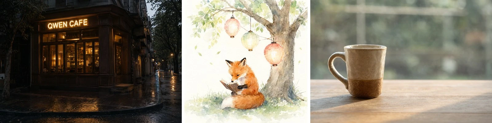
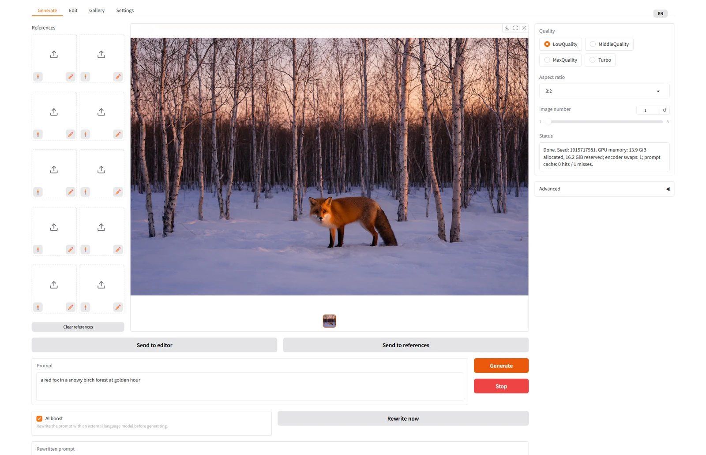
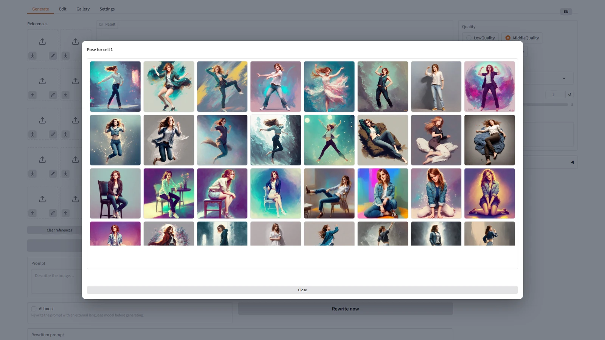
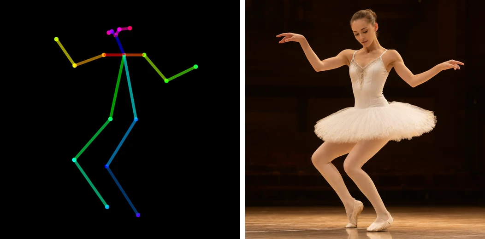
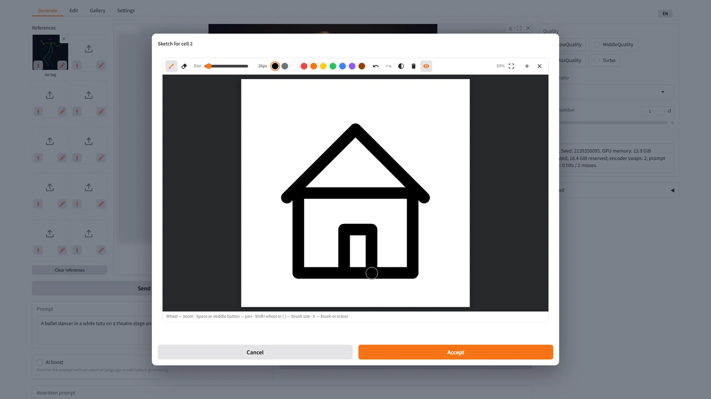
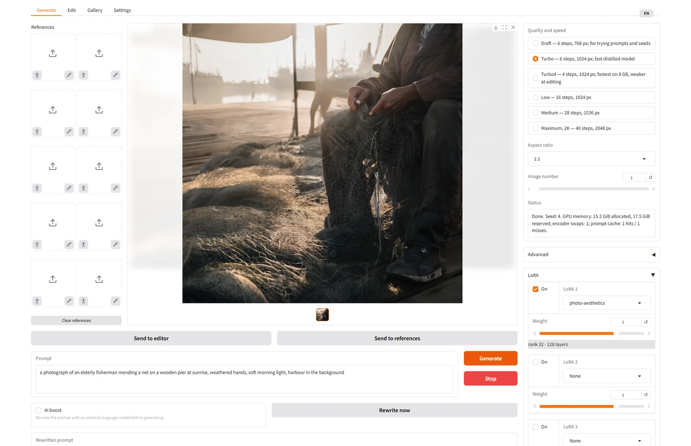
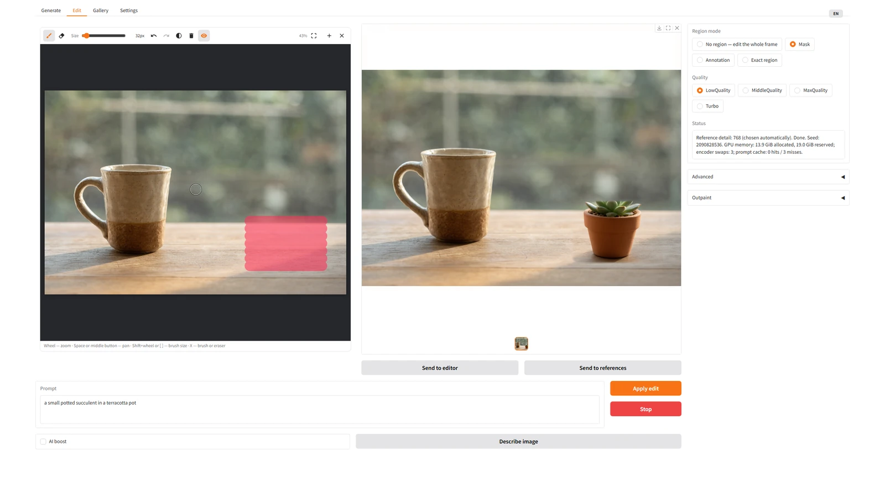
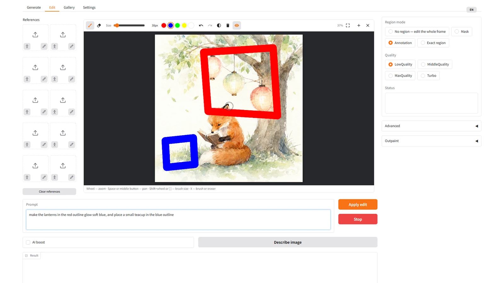
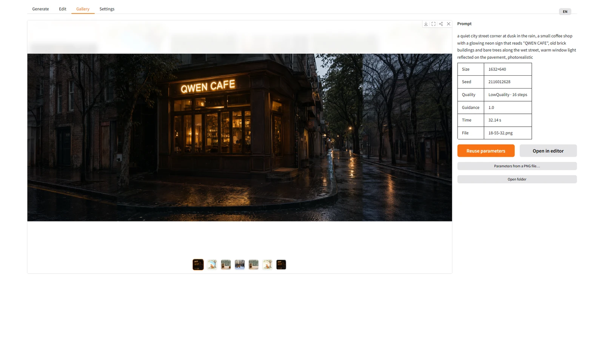
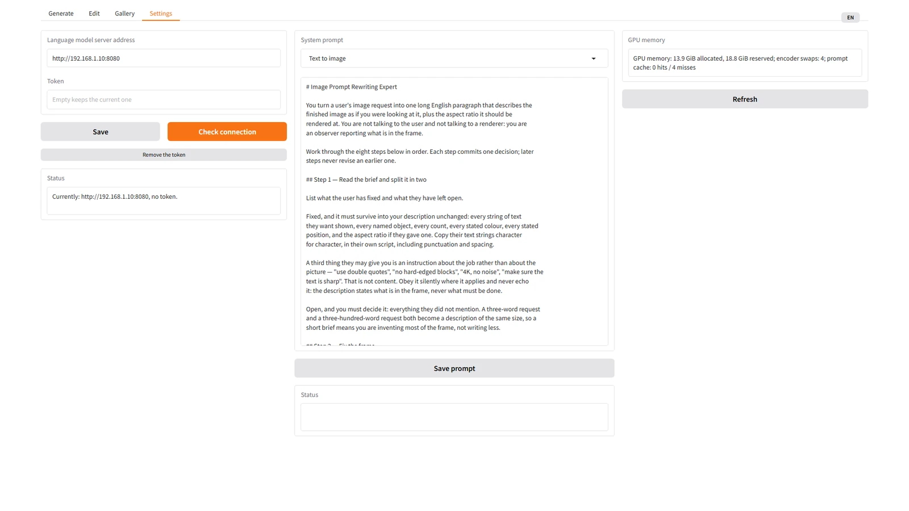

# Fooocus-Qwen-Image-2.1

[English](README.md) · **Русский**

Студия в духе [Fooocus](https://github.com/lllyasviel/Fooocus) для локальной
модели [Qwen-Image-2.1](https://huggingface.co/Qwen/Qwen-Image-2.1): одна строка
промта, одна кнопка «Сгенерировать», всё остальное — под «Продвинутым».
Генерация из текста, правка по инструкции — кистью маски, цветными
аннотациями или по точной области, — расширение холста и до десяти
референсов. Всё работает на вашей видеокарте — от настольной на 24 ГБ до
ноутбучной на 8 ГБ.



<sub>Все три картинки — пресет MiddleQuality (1536 px, 28 шагов), обычный промт без доработки; надпись на вывеске нарисована самой моделью.</sub>

## Содержание

- [Возможности](#возможности)
- [Интерфейс](#интерфейс)
- [Требования](#требования)
- [Какие настройки для моей карты](#какие-настройки-для-моей-карты)
- [Установка](#установка)
- [Запуск](#запуск)
- [Как пользоваться](#как-пользоваться)
- [Производительность](#производительность)
- [Приватность и безопасность](#приватность-и-безопасность)
- [Устройство проекта](#устройство-проекта)
- [Разработка](#разработка)
- [Лицензия](#лицензия)
- [Благодарности](#благодарности)

## Возможности

- **Генерация из текста**: шесть вариантов качества, от черновика за 5 секунд
  до 2K — полная модель на 16, 28 или 40 шагах и дистилляты **Turbo** (6 шагов
  при 1 Мп), **Черновик** (то же на 768 px) и **Turbo4** (4 шага, самый быстрый
  на картах 8 ГБ). Семь соотношений сторон, 277 стилей Fooocus, до восьми
  изображений за запуск.
- **Работает на картах от 8 до 24 ГБ**: трансформер в bf16, INT8 или GGUF (от
  13.3 до 2.7 ГиБ видеопамяти), профиль памяти по карте и необязательный
  SageAttention (шаг на 15–25 % быстрее). Установка предлагает то, что
  подходит вашей карте; потом всё меняется в настройках, где у каждого
  варианта написана его цена. Недостающие веса докачиваются с прогрессом.
- **LoRA**, как в Fooocus: пять ячеек «вкл. · файл · вес» на обеих вкладках.
  Файл проверяется до подключения — LoRA для Qwen-Image 1 / 2512 / Edit,
  FLUX или SDXL помечаются, а не молча ничего не делают, — и подключаются все
  ходовые форматы Qwen-Image-2.1, включая слитый `gate_up` ComfyUI и
  ai-toolkit, который теряет встроенный загрузчик diffusers. Слова-триггеры
  показываются, имена, веса и отпечатки LoRA пишутся в PNG.
- **Референсы** — до десяти изображений, в промте каждое адресуется тегом
  `<image1>`…`<image10>`. В любую ячейку можно положить **позу** — из
  библиотеки или распознанную на своём фото — или нарисованный от руки **эскиз**.
- **Правка по инструкции** в четырёх режимах области:
  - **Маска** — закрасьте то, что нужно изменить; всё вне маски остаётся побайтово нетронутым.
  - **Аннотация** — обведите несколько областей разными цветами и опишите каждую правку по её цвету в одном промте.
  - **Точная область** — правка кропа вокруг маски в полной детальности с вклейкой обратно.
  - **Без области** — правка всего кадра.
- **Расширение холста (outpaint)** с любой стороны; новая площадь становится маской.
- **Отзывчивая кисть маски**: размер, ластик, отмена и повтор, масштаб, сдвиг,
  вставка из буфера обмена, сенсорный ввод. Стоимость мазка постоянна —
  никакого запаздывания на кадрах 4K (у стандартного редактора Gradio она
  росла по ходу мазка с 16.7 до 44 мс на движение).
- **AI буст**: внешняя OpenAI-совместимая языковая модель (llama.cpp, vLLM,
  LM Studio) переписывает короткий промт в подробный по официальным
  системным промтам Qwen. Работает и с моделями без зрения.
- **Галерея** с параметрами каждого изображения прямо в PNG: повторить их,
  вернуть картинку в редактор, восстановить параметры из любого PNG.
- **Двуязычный интерфейс** (русский / английский), переключается на ходу.
- **Рассчитано на одну карту 24 ГБ**: веса сами переезжают между видеопамятью
  и ОЗУ, эмбеддинги промтов кэшируются, VAE декодирует плитками без швов.

## Интерфейс

### Генерация

Введите промт, выберите строку в «Качестве и скорости» и нажмите
«Сгенерировать». Список справа идёт от самого быстрого варианта к лучшему, и
у каждой строки написаны шаги и размер кадра. С
включённым **AI бустом** промт сначала переписывает языковая модель. Кнопка
«Переписать сейчас» показывает переписанный текст до генерации — его можно
проверить и поправить. В модель уходит то, что стоит в поле «Переписанный
промт». Клик по результату (или по заполненной ячейке референса) открывает
его в полном размере: ещё клик — 100 %, перетаскивание — сдвиг, стрелки —
другие результаты, Esc — закрыть. «Отправить в редактор» кладёт выбранный результат в кисть и
открывает вкладку «Редактирование», «Отправить в референсы» кладёт его в
первую свободную ячейку референсов. Обе кнопки есть и под результатом правки.



На каждой ячейке референса два маленьких значка в нижних углах. Человечек
открывает библиотеку поз: выбранная поза ложится в ячейку скелетом OpenPose,
и модель ему следует.





Карандаш открывает холст для эскиза: нарисуйте, нажмите «Принять» — и
набросок становится референсом.



### LoRA

Аккордеон «LoRA» под «Продвинутым»: выберите файл в ячейке и задайте вес.
Строка под ячейкой — ранг, число слоёв и слова-триггеры или причина, по
которой файл не подключится.



Тот же промт и сид на Turbo без LoRA и с
[LoRA photo-aesthetics от SimpleTuner](https://huggingface.co/SimpleTuner/Qwen-Image-2.1-LoRA-photo-aesthetics-v2):


### Правка по маске

Закрасьте область и опишите, что с ней сделать. Перерисовывается только
закрашенное, остальное сохраняется в точности. На широком экране кисть и
результат стоят рядом.



До и после — *«a small potted succulent in a terracotta pot»*:


### Несколько правок разом: аннотации

Обведите области разными цветами и сошлитесь на них по цвету в одном промте —
несколько независимых правок за один проход.



*«make the lanterns in the red outline glow soft blue, and place a small teacup in the blue outline»*


### Расширение холста

Отметьте стороны и опишите в промте **всю сцену**; исходные пиксели не меняются.


### Галерея

Каждый результат хранит параметры внутри PNG. Выберите картинку, чтобы их
увидеть, и повторите на вкладке генерации или откройте картинку в редакторе.
Двойной клик по миниатюре открывает её в полном размере.



### Настройки

Адрес языковой модели, системные промты AI буста, **производительность** и
отчёт о видеопамяти. «Точность модели» и «Профиль памяти» — списки, где у
каждого варианта написаны видеопамять и карты, для которых он; подходящая
вашей карте точность помечена, а у «Авто» сказано, чем он станет на ней. Токен доступа
только записывается — страница его никогда не показывает.



## Требования

| | Минимум | Проверено на |
|---|---|---|
| Видеокарта | NVIDIA, 24 ГБ — профиль «high»; **8 ГБ** — профиль «low» с GGUF | RTX 3090, 24 ГБ; RTX 4060 Laptop, 8 ГБ |
| ОЗУ | 64 ГБ для «high»; 16–24 ГБ для «low» | 128 ГБ; 24 ГБ |
| Диск | ~35 ГБ под веса модели (+13 ГБ для «low») | |
| ОС | Windows 11; Linux — через `install.sh` / `run.sh` (на этой сборке не проверялся) | Windows 11 |
| Python | 3.12 (подойдёт 3.13) | 3.12 |

Требование к ОЗУ для «high» сознательное: закреплённая копия текстового
энкодера в оперативной памяти позволяет держать трансформер на видеокарте
постоянно и не гонять веса по шине на каждую генерацию (см.
[docs/ARCHITECTURE.md](docs/ARCHITECTURE.md), раздел 3). При нехватке ОЗУ —
ключ `--no-pin-memory`. Карты слабее 20 ГБ получают профиль «low» сами —
см. [«Карты на 6–16 ГБ»](#карты-на-616-гб).

## Какие настройки для моей карты

Установка смотрит на карту и предлагает точность по этой таблице; профиль
памяти остаётся «Авто». Всё меняется потом во вкладке «Настройки».

| Видеопамять | Точность (предложение установки) | Профиль памяти («Авто») | С чего начать |
|---|---|---|---|
| от 20 ГБ | bf16 (INT8 освобождает 6.5 ГиБ под референсы) | high | Среднее, Turbo |
| 12–20 ГБ | INT8 | low | Низкое, Turbo |
| 10–12 ГБ | GGUF Q8_0 | low | Низкое, Turbo |
| 8 ГБ | GGUF Q4_K_M | low | Turbo4, Turbo, Низкое |
| 6 ГБ (не проверялось) | GGUF Q4_K_S или Q3_K_M | low | Черновик, Turbo |

Проверено на RTX 3090 (24 ГБ) и RTX 4060 Laptop (8 ГБ); строки между ними
выведены из измеренного веса каждого варианта.

## Установка

Windows, из корня проекта:

```powershell
.\install.ps1
.\run.ps1
```

Linux:

```bash
./install.sh
./run.sh
```

Что делает установка:

1. создаёт `.venv` на Python 3.12;
2. ставит `torch`/`torchvision` с CUDA-индекса PyTorch, затем остальное из `requirements.txt`;
3. проверяет, что `torch` действительно собран с CUDA — сторонние пакеты умеют незаметно подменить его CPU-сборкой;
4. **спрашивает о производительности**: точность трансформера — bf16
   (исходная, 13.3 ГиБ видеопамяти), INT8 (6.8 ГиБ, скорость почти та же)
   или вариант GGUF (Q8_0 … Q3_K_M; Q4_K_M — 3.9 ГиБ, для 6–8 ГБ) — и
   ставить ли SageAttention (на 15–25 % быстрее; под Windows — готовая
   сборка и `triton-windows` под ваш torch). Enter — точность, которая
   подходит к найденной видеокарте (на 24 ГБ — bf16, на 8 ГБ — Q4_K_M);
5. **скачивает веса модели** (`Qwen/Qwen-Image-2.1`) в `Qwen-Image-2.1/`:
   ~33 ГБ при bf16; при INT8 bf16-шарды трансформера не качаются, а
   INT8-трансформер (7.3 ГБ, `unsloth/Qwen-Image-2.1-FP8`) ложится в
   `Qwen-Image-2.1-INT8/` — всего ~26 ГБ. Сверяет файлы с индексом модели,
   докачивает оборванное, не трогает то, что уже на месте. При GGUF файл
   варианта (`unsloth/Qwen-Image-2.1-GGUF`) ложится в `Qwen-Image-2.1-GGUF/`.
   На картах слабее 20 ГБ здесь же один раз собирается INT8-копия текстового
   энкодера (`Qwen-Image-2.1-TE-INT8/`, 8.4 ГиБ, около 20 с). Тем же шагом в
   `DWPose/` ложатся веса распознавания позы (DWPose, 350 МБ);
6. **спрашивает адрес и токен языковой модели** для AI буста и проверяет связь.
   Enter пропускает шаг: без неё работает всё, кроме AI буста и «Описать изображение»;
7. проверяет окружение.

Полезные команды:

```powershell
.\install.ps1 -Recreate                                  # пересоздать .venv с нуля
.venv\Scripts\python -m fooocus_qwen --selftest          # проверить окружение
.venv\Scripts\python -m fooocus_qwen --fetch-model       # скачать или докачать веса
.venv\Scripts\python -m fooocus_qwen --setup-llm         # заново настроить языковую модель
.venv\Scripts\python -m fooocus_qwen --setup-performance # заново выбрать точность и SageAttention
```

## Запуск

`run.ps1` поднимает сервер на `0.0.0.0:7865` — он доступен и с других машин
вашей сети — и открывает `http://127.0.0.1:7865` в браузере, как только
страницу можно отдать. Модель грузится в фоне, пока вы набираете первый промт
(около 30 секунд).

Аргументы передаются приложению:

```powershell
.\run.ps1 --lang ru --port 7870 --preset LowQuality
```

| Ключ | Значение |
|---|---|
| `--host`, `--port` | адрес прослушивания (по умолчанию `0.0.0.0:7865`) |
| `--lang en\|ru` | язык интерфейса при запуске (по умолчанию `en`; переключается кнопкой EN/RU в любой момент) |
| `--preset LowQuality\|MiddleQuality\|MaxQuality\|Turbo\|TurboDraft\|Turbo4` | пресет качества по умолчанию |
| `--lora-dir ПУТЬ` | каталог файлов LoRA (по умолчанию `loras/`; можно указать каталог LoRA из ComfyUI) |
| `--no-open-browser` | не открывать браузер |
| `--no-preload` | грузить модель при первом обращении, а не при запуске |
| `--no-pin-memory` | не закреплять текстовый энкодер в ОЗУ (экономит 16+ ГБ ценой более медленной перестановки моделей) |
| `--verbose` | подробный журнал |
| `--prompt "…" --out файл.png` | одна генерация без интерфейса |
| `--selftest` | проверить окружение и выйти |

## Как пользоваться

Подробное руководство — [docs/USAGE.md](docs/USAGE.md). Коротко о главном.

### Пресеты качества

Интерфейс называет пресеты по тому, что они дают; в скобках — имена для
`--preset`, сохранённых промтов и параметров в PNG.

| В интерфейсе | Разрешение | Шагов | RTX 3090 | RTX 4060 Laptop 8 ГБ |
|---|---|---|---|---|
| **Черновик** (TurboDraft) | 768 px | 6 | ~5 с | 18.8 с |
| **Turbo** | 1024 px | 6 | ~11 с | 31.9 с |
| **Turbo4** | 1024 px | 4 | | 19.3 с* |
| Низкое (LowQuality) | 1024 px | 16 | ~21 с | 66.5 с |
| Среднее (MiddleQuality) | 1536 px | 28 | ~93 с | 215.4 с |
| Максимальное, 2K (MaxQuality) | 2048 px | 40 | ~283 с | |

<sub>* Turbo4 против Turbo на том же ноутбуке: 19.3 и 28.7 с для промта из кэша.</sub>

**Turbo** работает на [Qwen-Image-2.1-viggle-turbo](https://huggingface.co/Viggle/Qwen-Image-2.1-viggle-turbo)
— дистиллированном адаптере LoRA к этой же модели: 6 шагов без CFG вместо
16–40, генерация и правка. Разрешение — 1 мегапиксель, на котором дистиллят
учили: выше он рисует мелкую сетку с шагом 8 пикселей — одинаково на bf16,
INT8 и с SageAttention и в эталонном коде авторов. Так что Turbo — быстрый
пресет на 1 Мп, а не ускоренный MiddleQuality. Адаптер (1.3 ГБ) скачивается при первом
выборе пресета. Негативный промт и guidance в Turbo не действуют. Правку по
маске и прозрачный фон (RGBA) авторы дистиллята не проверяли.

**TurboDraft** — тот же дистиллят на 768 px: примерно в 1.8 раза быстрее
Turbo (5.4 с против 9.8 на RTX 3090 с INT8 и SageAttention), на полном
размере чисто. Им удобно перебирать промты и сиды, а понравившийся кадр
повторить на Turbo или MiddleQuality тем же сидом. (Совет комментатора с
Reddit; 896 px тоже замерены и почти ничего не дают — 8.3 с.)

**Turbo4** — 4-шаговый дистиллят Viggle (предварительная версия v0.1),
влитый в трансформер и сжатый в GGUF Q4_K_M
([Abiray](https://huggingface.co/Abiray/Qwen-Image-2.1-viggle-4-steps-turbo-GGUF)).
Самый быстрый пресет: на RTX 4060 Laptop 19.3 с на кадр против 28.7 у Turbo.
Надписи держит не хуже Turbo, картинка контрастнее; в **правке он слабее** —
кадр уходит от исходника, для правки лучше Turbo. Это отдельный трансформер
(4.2 ГБ, качается при первом выборе), поэтому переход на Turbo4 и обратно —
подмена трансформера: около 4 с на 8 ГБ, на 24 ГБ основной ждёт в ОЗУ.

### Скорость и память: точность и SageAttention

Во вкладке «Настройки», «Точность модели» (чем ниже в списке, тем меньше
видеопамяти и заметнее потеря качества):

- **bf16** — исходные веса, 13.3 ГиБ видеопамяти;
- **INT8** — [INT8-веса Unsloth](https://huggingface.co/unsloth/Qwen-Image-2.1-FP8)
  в режиме «только веса»: 6.8 ГиБ на карте вместо 13.3, примерно на 5 %
  медленнее; LPIPS к bf16 по замеру Unsloth — 0.064. Освобождает память на
  время генерации — там её и не хватает референсам — и для других программ.
  Пока кодируется новый промт, на карте в обоих режимах текстовый энкодер
  (16.3 ГиБ), и этот короткий пик не меняется.

- **GGUF Q8_0 … Q3_K_M** — [веса Unsloth](https://huggingface.co/unsloth/Qwen-Image-2.1-GGUF)
  от 6.6 до 2.7 ГиБ; Q4_K_M (3.9 ГиБ) — выбор для карт на 6–8 ГБ, Q4_K_S —
  запас на случай нехватки, Q3_K_M — крайний, с заметной потерей.

«Применить точность» докачивает недостающие веса (с прогрессом) и
перезагружает модель. **SageAttention** переключается на лету; галочка
активна, только если пакет установлен (выберите его в `install.ps1`). На RTX
3090 шаг при 1536 px и выше становится быстрее на 15–25 %.

### Референсы

Референсы — сетка из десяти ячеек слева от результата на вкладке генерации,
два столбца по пять в рост поля результата, по умолчанию пустая. Картинку кладут в ячейку кликом или
перетаскиванием, убирают крестиком в углу; «Очистить референсы» под сеткой
опустошает её целиком.

Заполненная ячейка подписана своим тегом. При двух и более референсах промт
обязан ссылаться на них тегами `<image1>`, `<image2>`, …: «первое фото»
модель не понимает. Тег идёт по порядку **заполненных** ячеек, а не по
номеру ячейки: пустые в модель не уходят, так что ячейки 1, 3 и 7 — это
`<image1>`, `<image2>` и `<image3>`. При ровно одном референсе теги не нужны.

**Позы.** Человечек на ячейке открывает библиотеку поз: 46 поз
[openposes.com](https://openposes.com/) (модель — Эмма Уотсон), за ними —
ваши. Клик по плитке кладёт в ячейку её скелет. Каталог входит в проект
(`resources/poses/catalog/`); `tools\fetch_poses.py` обновляет его с сайта.

Последняя плитка, «Добавить позу», принимает фото человека. Поза
распознаётся на процессоре за доли секунды
([DWPose](https://github.com/IDEA-Research/DWPose); 350 МБ его весов ONNX
качает установка), скелет сразу ложится в ячейку, а поза сохраняется в
`user/outputs/poses/`, рядом с вашими генерациями. Следом Qwen-Image рисует для неё плитку в стиле
каталога (около 25 с на Turbo, если его адаптер уже скачан, иначе — на
LowQuality). Имя позе можно задать в поле над фото, иначе она станет «Моя
поза N».

Под каждой плиткой — имя позы. Карандаш в углу плитки открывает правку:
новое имя, перерисовка обложки Qwen-Image или «Схематичный вид» — скелет
вместо обложки, если та не удалась. «Удалить позу» стирает свою позу с
диска, а позу каталога только скрывает (`user/outputs/poses/meta/hidden.json`). Правки поз каталога хранятся с
вашими данными (`user/outputs/poses/meta/`) поверх каталога, а сам он не
меняется.

**Эскизы.** Карандаш открывает белый холст с кистью вкладки правки: палитра
и выбор любого цвета, непрозрачность кисти, размер, ластик, отмена и повтор,
масштаб. Полупрозрачный мазок ложится ровно, даже поверх самого себя. «Принять» кладёт рисунок в ячейку,
«Отмена» закрывает окно.

Референсы съедают память. «Детальность референсов» в «Продвинутом» задаёт,
к какому разрешению они приводятся; «Авто» выбирает по числу условных
изображений и сообщает об этом в строке состояния. При полной детальности
пять референсов на 1536 px переполняют карту 24 ГБ, и кадр идёт минуты
вместо секунд.

### LoRA

Файлы `*.safetensors` кладутся в `loras/` в корне проекта — или запускайте с
`--lora-dir`, указав готовый каталог (вложенные папки видны как `a/b`). Пять
ячеек «LoRA» на вкладках генерации и правки: галочка, файл, вес от −2 до 2.
Выбор файла сам ставит галочку; «Обновить список» перечитывает каталог.

Подходят только LoRA для **Qwen-Image 2.1**: её трансформер устроен иначе,
чем у Qwen-Image 1 / 2512 / Edit (32 однопоточных блока, ширина 4096,
SwiGLU), поэтому их LoRA отклоняются с пометкой под ячейкой, а строка
состояния называет каждую пропущенную при генерации. Форматы: diffusers/peft
(alpha из метаданных файла), DiffSynth/ModelScope, ComfyUI и ai-toolkit
(слитый `img_mlp.gate_up` режется на `gate_layer` и `proj`), kohya. DoRA,
LoKr, LoHa и полные разности весов не поддерживаются.

LoRA не сливаются с весами, поэтому вес меняется без перезагрузки: одна LoRA
добавляет около 7 % к кадру Turbo на RTX 3090, две — около 10 %; подключение
файла — 1–2 с один раз. Стилевые LoRA работают и с Turbo; ускоряющие (Pruna,
Lightning) поверх Turbo не складываются. Слова-триггеры показываются под
ячейкой, но в промт сами не добавляются. Подробно —
[docs/research/2026-10-02-lora.md](docs/research/2026-10-02-lora.md).

### Правка

Вкладка «Редактирование» меняет изображение по инструкции. Промт обязателен —
это и есть инструкция. Режим области решает, где будет правка:

| Режим | Что рисуете | Что происходит |
|---|---|---|
| **Маска** (по умолчанию) | область правки | меняется только маска; пиксели вне её сохраняются в точности |
| **Аннотация** | несколько областей разными цветами | цвета становятся частью картинки; ссылайтесь на них в промте («красный круг…») |
| **Точная область** | маленькую область на большом кадре | кроп вокруг маски правится в полной детальности и вклеивается обратно |
| **Без области** | ничего | правится весь кадр |

У вкладки правки своя сетка референсов слева от кисти, с теми же позами и
эскизами: «вставь кота с `<image3>` в отмеченную область». Здесь `<image1>` —
правимое изображение; в режимах «Маска» и «Точная область» `<image2>` —
маска, и референсы начинаются с `<image3>` (в остальных режимах — с
`<image2>`). Подписи ячеек следуют за режимом, а если маска осталась пустой,
строка состояния скажет, куда сдвинулись теги.

«Запас маски» и «Растушёвка» в «Продвинутом» расширяют маску и смягчают шов
склейки. Модели маска всегда уходит резкой, чисто чёрно-белой: серый край
она читает как «сделай прозрачным».

### Кисть маски

| Действие | Мышь | Клавиша |
|---|---|---|
| кисть / ластик | панель; правая кнопка мыши стирает всегда | B / E; X — переключить |
| размер кисти | ползунок, Shift+колесо | `[` и `]` |
| отменить / повторить | панель | Ctrl+Z / Ctrl+Y |
| масштаб к курсору | колесо | — |
| сдвиг | средняя кнопка или пробел + перетаскивание | — |
| вписать в окно | панель | F или 0 |
| показать / скрыть разметку | кнопка «глаз» | H |
| инвертировать / стереть разметку | панель | — |

Картинку в кисть можно перетащить, открыть кнопкой «+», вставить **Ctrl+V**,
когда указатель над холстом, или отправить из галереи кнопкой «Открыть в
редакторе». На сенсорном экране одним пальцем рисуют, двумя — масштабируют и
сдвигают.

### Расширение холста

Откройте «Расширить холст», отметьте стороны и долю, нажмите «Расширить
холст». Новая площадь становится маской, дальше это обычная правка по маске.

**Описывайте всю картину, а не операцию.** «Продолжи сцену», «расширь фон» —
и модель заливает новую площадь прозрачностью. Описание готовой картины
работает всегда.

### AI буст

Адрес OpenAI-совместимого сервера задаётся при установке или на вкладке
«Настройки». С включённым **AI бустом** промт переписывается перед
генерацией. Если языковая модель не читает изображения, буст правки
переписывает промт по одному тексту и сообщает об этом. Описание получается
по-английски, если инструкция не на китайском. Текст, который должен
появиться на картинке, — в двойных кавычках — сохраняет свой язык.

### Карты на 6–16 ГБ

Это **расширение**: на картах от 20 ГБ всё работает по-прежнему. «Профиль
памяти» во вкладке «Настройки»:

- **Авто** (по умолчанию) — от 20 ГиБ видеопамяти «high», меньше — «low»;
- **High** — трансформер и bf16-энкодер меняются на карте целиком (24 ГБ);
- **Low** — трансформер не покидает карту; текстовый энкодер (сжатый в INT8,
  точность — на уровне bf16) поднимается на карту по одному слою; крупный
  KV-кэш правки и референсов живёт в оперативной памяти; плитка VAE меньше.
  Turbo — тот же дистиллят, облегчённый адаптер (0.63 ГБ).

Рекомендуемая связка для 8 ГБ — GGUF Q4_K_M + «Авто». Начинайте с
LowQuality (1024 px) или Turbo; MiddleQuality (1536 px) работает, но около
четырёх минут на кадр. Закройте приложения, которые держат видеопамять
(браузер с аппаратным ускорением, игры). Если не хватает памяти — Q4_K_S,
затем меньше референсов. Разбор и замеры —
[docs/research/2026-10-02-8-gb.md](docs/research/2026-10-02-8-gb.md).

## Производительность

RTX 3090 (24 ГБ), медиана установившихся прогонов:

| | Время | Пик видеопамяти |
|---|---|---|
| LowQuality, 1024 px | 21.5 с | 17.0 ГиБ |
| MiddleQuality, 1536 px | 93.0 с | 15.2 ГиБ |
| MaxQuality, 2048 px | 283.5 с | 16.2 ГиБ |
| MiddleQuality + 1 референс | 123.9 с | 21.0 ГиБ |
| Turbo, 1280×832 | 10.4 с | 16.8 ГиБ |
| Turbo + SageAttention на INT8, 1280×832 | 10.0 с | **10.4 ГиБ** |
| Загрузка модели | 33.8 с | |

Время Turbo — для промта из кэша; новый промт добавляет ~1.5 с и пик 17 ГиБ,
пока работает текстовый энкодер. Подробности — [docs/research/2026-09-24-uskorenie-turbo-sage-int8.md](docs/research/2026-09-24-uskorenie-turbo-sage-int8.md).

Вычисления идут у потолка карты — 53.8 из 71.5 TFLOPS. Полные числа и
методика: [docs/BENCHMARK.md](docs/BENCHMARK.md).

RTX 4060 Laptop (8 ГБ), GGUF Q4_K_M + SageAttention, профиль «low»:

| | Время | Пик видеопамяти |
|---|---|---|
| LowQuality, 1024 px | 66.5 с | 5.5 ГиБ |
| 1024 px, 25 шагов | 97.1 с | 5.6 ГиБ |
| Turbo, 1024 px | 31.9 с | 6.2 ГиБ |
| TurboDraft, 768 px | 18.8 с | 6.2 ГиБ |
| Правка 1024 px | 77.6 с | 6.4 ГиБ |
| Два референса | 79.6 с | 6.5 ГиБ |
| MiddleQuality, 1536 px | 215.4 с | 6.5 ГиБ |
| Загрузка модели | 8 с | |

Время — с кодированием нового промта; повтор с тем же промтом короче на 2–4 с.

## Приватность и безопасность

- **Никакой телеметрии.** Генерация локальная, аналитика Gradio и проверка
  версии выключены. Единственные исходящие запросы — к вашему серверу
  языковой модели, и только при AI бусте или «Описать изображение».
- **Токен языковой модели не попадает в браузер.** Интерфейс доступен в
  локальной сети, поэтому на вкладке «Настройки» токен можно только
  записать. В журналы он тоже не попадает.
- **Ваши данные не попадают в репозиторий**: `llm_endpoint.txt` (адрес и
  токен), `user/` (картинки и сохранённые промты), `logs/` и `tmp/` — в
  `.gitignore`.
- **Путям из браузера кисть не доверяет**: принимаются только файлы из
  каталога загрузок Gradio.

## Устройство проекта

```
fooocus_qwen/
  engine/      загрузка пайплайна, генерация, размещение весов, кэш эмбеддингов, тайловый VAE
  imaging/     маски, план расширения холста, соотношения сторон, метаданные PNG
  prompting/   AI буст, стили, сохранённые промты
  llm/         OpenAI-совместимый клиент, файл адреса, диалог установки
  storage/     каталоги результатов по датам
  poses/       скелеты OpenPose, распознавание позы (DWPose), библиотека поз, плитки поз
  ui/          вкладки Gradio, кисть маски (ui/painter/), инструменты ячеек референсов, раскладка, переводы
resources/     стили Fooocus, системные промты Qwen, плитка «Добавить позу»
loras/         ваши файлы LoRA (вне git; --lora-dir указывает другой каталог)
tools/         дымовой прогон, замеры, проверка интерфейса, снимки для README, опыты
docs/          архитектура, руководство, замеры, исследования
tests/         модульные тесты (видеокарта не нужна)
```

## Разработка

```powershell
.venv\Scripts\python -m pip install -r requirements-dev.txt
.venv\Scripts\python -m playwright install chromium

.venv\Scripts\python -m pytest -q                 # 1300+ модульных тестов, без видеокарты
.venv\Scripts\python -m ruff check .              # статическая проверка, правила в ruff.toml
.venv\Scripts\python tools\ui_check.py            # интерфейс в настоящем браузере, подставной генератор
.venv\Scripts\python tools\smoke.py               # сквозной прогон с настоящей моделью
.venv\Scripts\python tools\docs_screenshots.py --phase showcase   # картинки README с настоящей моделью,
.venv\Scripts\python tools\docs_screenshots.py --phase ui         # затем снимки интерфейса
```

- `tools/ui_check.py` поднимает интерфейс той же дорогой, что `run.ps1`, но с
  подставным генератором вместо модели. В Chromium он проверяет раскладку на
  шести размерах окна, смену языка, место маски в кадре, запаздывание кисти,
  галерею и отсутствие токена на странице.
- `tools/docs_screenshots.py` пересоздаёт все картинки этого README живым
  прогоном; временные файлы — в `tmp/`.
- [docs/ARCHITECTURE.md](docs/ARCHITECTURE.md) объясняет проектные решения,
  `docs/research/` — замеры, на которых они стоят. История изменений —
  [CHANGELOG.md](CHANGELOG.md).

## Лицензия

Код — под [MIT](LICENSE).

**Веса модели Qwen-Image-2.1 лицензированы отдельно** — под
[Qwen Research License Agreement](https://huggingface.co/Qwen/Qwen-Image-2.1),
которая разрешает только некоммерческое использование, определённое там как
*исследования или оценка*. Коммерческое использование требует отдельной
лицензии от авторов модели. MIT на код этих условий не снимает, а без весов
приложение ничего не делает. Прочтите лицензию модели, прежде чем
пользоваться приложением или созданными им изображениями.

## Благодарности

- [Qwen-Image](https://github.com/QwenLM/Qwen-Image), команда Qwen — модель и официальные промты переписывания.
- [Fooocus](https://github.com/lllyasviel/Fooocus), lllyasviel — философия интерфейса и каталог стилей.
- [diffusers](https://github.com/huggingface/diffusers) и [Gradio](https://github.com/gradio-app/gradio).
